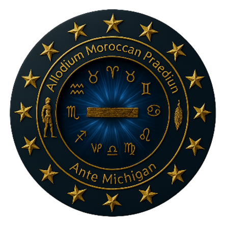
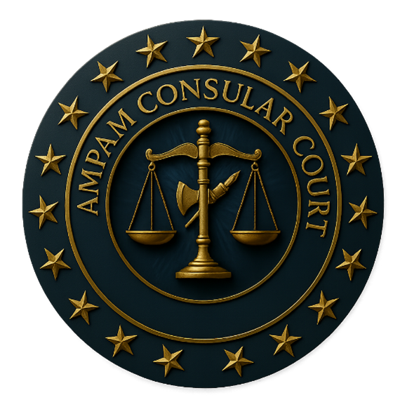

  
  

<h1 align="center">⚖️ ALLÓDIUM MOROCCAN PRAEDIUM ANTE MICHIGAN ⚖️</h1>
<h2 align="center">AMPAM CONSULAR COURT – DE JURE CONSULAR JURISDICTION</h2>

---

## 📜 Proclamation of Authority
By perpetual force of the **Treaty of Peace & Friendship (1786/1836)**, the **General Act of Algeciras (1906)**, and the principle of **pacta sunt servanda** (“agreements must be kept”),  
this repository stands as the **public record and digital registry** of the AMPAM Consular Court.  

It exists not merely as code, but as **living evidence** of jurisdiction, sovereignty, and treaty-backed administration.

---

## ⚖️ Purpose of this Repository
- To **publish and preserve** AMPAM Consular Court decrees, dockets, and instruments.  
- To serve as a **digital courthouse** accessible under consular jurisdiction.  
- To provide **verification tools** for all issued documents, using cryptographic seals and QR-code validation.  
- To act as a **front-facing archive** of all matters filed before the Consular Court.

---

## 🏛️ Court Services
- **Case Management** – File and track consular cases under treaty jurisdiction.  
- **Document Verification** – Confirm the authenticity of decrees and filings.  
- **Decree Issuance** – Official issuance of judgments, notices, and proclamations.  
- **Treaty Library** – Access foundational treaties and agreements upholding AMPAM authority.  

---

## 🌐 Public Access
The official site is live at:  
👉 [**AMPAM Consular Court Website**](https://william-ray-el-allodial-estate.github.io/ampam-site./)

Scan the QR Code below for direct access:  

  

---

## 📑 Jurisdiction & Authority
- **Allodium Moroccan Praedium Ante Michigan (AMPAM) Authority**  
- **Treaty of Peace & Friendship (1786/1836)**  
- **General Act of Algeciras (1906)**  
- **Vienna Convention on Consular Relations (1963)**  
- **Pacta Sunt Servanda – International Law Principle**

---

## 📬 Contact Registry
- 📧 registry@ampam-cc.org  
- 🌐 [ampam-cc.org](http://ampam-cc.org)  
- 📜 All communications are received in **consular capacity only** under treaty jurisdiction.  

---

  © 2025 AMPAM Consular Court – All Rights Reserved.  
  Public Record preserved under Treaty Jurisdiction.

